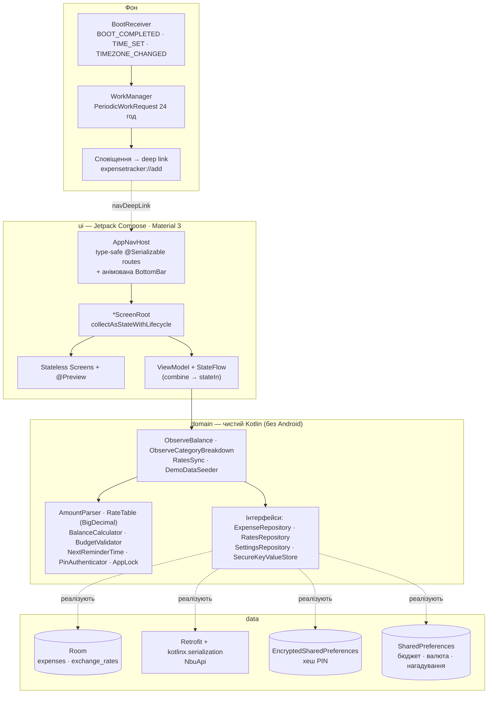
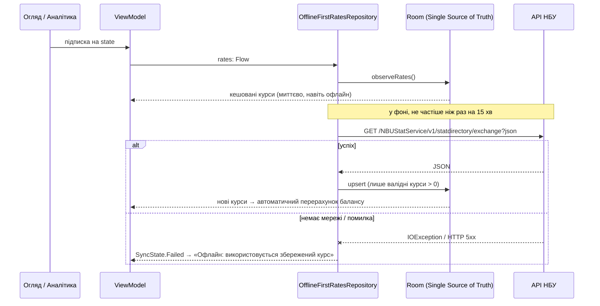
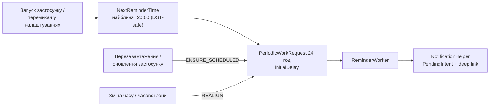

# Трекер витрат (Expense Tracker)

Нативний Android-застосунок для обліку особистих витрат: **Kotlin · Jetpack Compose · Material 3 · Navigation Compose
(type-safe) · Room + Flow · WorkManager · Retrofit**. Повний цикл із шести лабораторних робіт: додавання витрат,
баланс із місячним бюджетом, аналітика за категоріями, курси валют НБУ з офлайн-кешем, щоденне нагадування о 20:00,
PIN-захист і тести.

> **Статус перевірки.** На GitHub Actions (справжній Android-тулчейн: JDK 17 і 21, AGP 8.7.3, Gradle 8.10.2)
> зелені `testDebugUnitTest`, `assembleDebug` і `lintDebug`
> ([запуск №1](https://github.com/OMykhantso/lo/actions/runs/37133131738)): 255 unit-тестів, зібраний debug-APK.
> **На фізичному пристрої/емуляторі застосунок не запускався** — деталі в розділі
> [«Що перевірено, а що ні»](#що-перевірено-а-що-ні).

## Можливості

| | |
|---|---|
| **Додавання витрати** | числове поле (`KeyboardType.Decimal`), валюта (`SegmentedButton` UAH/USD/EUR), категорія (`FilterChip`), нотатка, валідація (сума > 0, обрана категорія), підказка «що лишиться від бюджету» |
| **Огляд** | залишок місячного бюджету з прогрес-баром і станом (норма / ≥80% / перевищено), перемикач валюти, останні витрати — усе перераховується реактивно, в т.ч. офлайн |
| **Аналітика** | анімована кільцева діаграма (Canvas) + смуги прогресу за категоріями, перехід у історію категорії |
| **Історія** | фільтр за категорією (`ExpenseHistoryRoute(category: String?)`), видалення з підтвердженням |
| **Курси НБУ** | USD/EUR → UAH, кеш у Room, працює без інтернету, показує «Офлайн: використовується збережений курс» |
| **Нагадування** | щодня о 20:00: «Не забудьте зафіксувати сьогоднішні витрати!», тап відкриває екран додавання витрати |
| **Безпека** | PIN (PBKDF2 + `EncryptedSharedPreferences`), ліміт спроб, `FLAG_SECURE`, `allowBackup=false` |

## Архітектура

Односпрямований потік даних (MVVM): `UiState` іде вниз, події — вгору. Єдине джерело правди — Room.



### Offline-First: курси валют

UI читає лише з бази. Мережа тільки поповнює кеш; якщо її немає — користувач бачить збережені курси.



### Нагадування о 20:00



### Структура коду

```
app/src/main/java/com/example/expensetracker/
├── domain/        model · money · validation · usecase · repository · security · notifications · time   (чистий Kotlin)
├── data/          local/db (Room) · remote (NBU) · repository · secure · prefs · mock
├── ui/            add · overview · analytics · history · settings · lock · components · navigation · theme · util
├── notifications/ ReminderScheduler · ReminderWorker · BootReceiver · NotificationHelper · дозвіл
├── di/            AppContainer · ViewModelFactories (ручний DI, без Hilt)
└── MainActivity · ExpenseTrackerApp
```

Правила залежностей і стилю — у [`Rules.md`](Rules.md).

## Відповідність лабораторним

| Лаб. | Вимога | Реалізація | Тести |
|---|---|---|---|
| **1** Базовий UI | `Surface/Column`, `KeyboardType.Decimal`, `FilterChip`/`SegmentedButton`, кнопка з валідацією (сума > 0) | `ui/add/AddExpenseScreen.kt`, `domain/money/AmountParser.kt`, `domain/validation/ExpenseValidator.kt` | `AmountParserTest`, `ExpenseValidatorTest`, `AddExpenseViewModelTest` |
| 1 · AI | `Rules.md`, палітра M3/HIG, Mock-дані | [`Rules.md`](Rules.md), `ui/theme/Palette.kt` + `Color.kt`, `data/mock/MockExpenses.kt` | `FinancePaletteTest` (WCAG 4.5:1 / 3:1), `MockExpensesTest` |
| **2** Навігація | `Navigation Compose 2.8+ (@Serializable)`: Баланс → Додавання → Історія(`category: String?`) | `ui/navigation/Routes.kt`, `AppNavHost.kt` | `RoutesTest` |
| 2 · AI | Bottom Navigation Bar з анімаціями | `ui/navigation/AppBottomBar.kt`, `NavTransitions.kt` | — (візуальна частина) |
| **3** БД і безпека | `Room + Flow`, таблиця `expenses (id, amount, category, timestamp, note)`, PIN у зашифрованому сховищі | `data/local/db/*`, `RoomExpenseRepository`, `data/secure/EncryptedPrefsKeyValueStore.kt`, `domain/security/*` | `SqlQueriesTest`, `RoomExpenseRepositoryTest`, `PinAuthenticatorTest`, `AppLockTest` |
| 3 · AI | `SUM(amount) GROUP BY category` за поточний місяць | `SqlQueries.CATEGORY_TOTALS` + покривний індекс | `SqlQueriesTest` (реальний SQLite, плани запитів) |
| **4** Offline-First | REST (НБУ), Single Source of Truth, `ViewModel + StateFlow`, баланс офлайн | `data/remote/*`, `OfflineFirstRatesRepository`, `ObserveBalance`, `OverviewViewModel` | `NbuApiTest` (MockWebServer), `OfflineFirstRatesRepositoryTest`, `BalanceCalculatorTest`, `OverviewViewModelTest` |
| 4 · AI | Кругова діаграма / ProgressBar | `ui/components/DonutChart.kt`, `CategoryBarRow.kt` | `ChartDescriptionTest` |
| **5** Фон | Щоденне нагадування о 20:00, тап → екран додавання | `notifications/*`, `NextReminderTime`, `navDeepLink` у `AppNavHost` | `NextReminderTimeTest` |
| 5 · AI | Точне планування + відновлення після перезавантаження (`RECEIVE_BOOT_COMPLETED`) | `BootReceiver`, `ReminderBootPolicy` | `ReminderBootPolicyTest` |
| **6** Тести | Баланс, конвертація, ліміт бюджету | `BalanceCalculatorTest`, `RateTableTest`, `BudgetTest` | усі разом **255 тестів** |
| 6 · AI | Edge cases (від’ємні суми, нульовий курс, немає інтернету) + README | `EdgeCasesTest` (в т.ч. fuzz), цей файл | `EdgeCasesTest` |

Опис кожного AI-завдання (запит → результат → як перевірено → що довелося виправити) — у [`docs/AI_LOG.md`](docs/AI_LOG.md).

## Запуск

Потрібно: **Android Studio Ladybug (2024.2) або новіша**, Android SDK 35 і **JDK 17–21 для Gradle**.

> **Якщо Studio пише «Gradle 8.10.2 is incompatible with the Gradle JVM version 25»** — нова Studio за
> замовчуванням бере JDK 25, а цей Gradle підтримує JDK 8–23. Натисніть **«Use JVM 21»** (або
> Settings ▸ Build, Execution, Deployment ▸ Build Tools ▸ Gradle ▸ *Gradle JDK* ▸ `jbr-21` / `17`).
> У терміналі: `JAVA_HOME=<шлях до JDK 17 або 21> ./gradlew assembleDebug`. CI перевіряє обидва — 17 і 21.

```bash
./gradlew assembleDebug          # зібрати APK  → app/build/outputs/apk/debug/
./gradlew installDebug           # встановити на підключений пристрій/емулятор
./gradlew testDebugUnitTest      # 255 unit-тестів
./gradlew lintDebug              # Android Lint
```

Або відкрийте теку в Android Studio (File ▸ Open) і запустіть конфігурацію `app`. Compose-прев’ю
(`@Preview`) є в основних екранах і компонентах — їх зручно переглядати без емулятора.

**Демо-дані:** Налаштування (⚙ на «Огляді») ▸ «Додати демо-витрати» — з’являться ~40 транзакцій за два місяці,
і одразу стануть видні баланс та діаграми. Бюджет задається там само.

### Як перевірити нагадування та deep link, не чекаючи 20:00

```bash
# Deep link «Додати витрату» (те саме, що відкриває сповіщення):
adb shell am start -a android.intent.action.VIEW -d "expensetracker://add" com.example.expensetracker

# Примусово запустити задачу WorkManager (знайти jobId у виводі dumpsys):
adb shell dumpsys jobscheduler | grep -B2 -A8 com.example.expensetracker
adb shell cmd jobscheduler run -f com.example.expensetracker <jobId>

# Відновлення після перезавантаження (на емуляторі/rooted):
adb shell am broadcast -a android.intent.action.BOOT_COMPLETED -p com.example.expensetracker
```

## Безпека: що захищено і як

* **PIN не зберігається** — лише `PBKDF2-HMAC-SHA256` (120 000 ітерацій, випадкова сіль 16 байт) у
  `EncryptedSharedPreferences` (ключі й значення шифруються AES-256, майстер-ключ — в Android Keystore).
* **Перебір обмежено**: 5 помилок → блокування 30 с, далі 1 хв → 5 хв → 15 хв; лічильники теж у захищеному сховищі.
* **Екран блокування** перекриває застосунок і при виході з нього на ≥ 30 с; під ним вміст прихований від TalkBack.
  Коли PIN увімкнено — `FLAG_SECURE` (немає в «Нещодавніх» і на скриншотах).
* `allowBackup=false`, лише HTTPS, відповіді API валідуються (курс > 0, відома валюта, сувора дата) до запису в БД.

**Чесно про межі:** PIN — це «замок інтерфейсу». 4-значний PIN не витримає офлайн-перебору, якщо зловмисник уже
дістав зашифрований файл *і* ключ Keystore (потрібен root + апаратна атака). **База витрат не шифрується**
(для цього потрібен SQLCipher); захист даних на пристрої спирається на системне шифрування Android.

## Рішення, які варто знати

* **Гроші — `Long` у копійках/центах**, не `Double`. Колонка `expenses.amount` зберігає мінімальні одиниці;
  додатково є `currency` (потрібна для конвертації), якої немає в мінімальному списку полів лаби.
* **Агрегація групує за `category, currency`**, а зведення в одну валюту робить домен за курсом
  (`RateTable`, `BigDecimal`, `HALF_UP`) — сума USD та UAH у SQL не має сенсу.
* Нульовий/від’ємний курс **неможливо побудувати**: `RateTable` і `ExchangeRate` відхиляють його в конструкторі,
  мапер НБУ та репозиторій відкидають такі значення ще до запису в кеш.
* `NextReminderTime` рахує 20:00 у «настінному» часі — коректно в дні зміни літнього/зимового часу
  (доба 23/25 год), на 29 лютого та в зонах, де календарний день пропущено (Самоа 2011).
* **WorkManager не гарантує секунду в секунду** — енергозбереження може зсунути запуск на хвилини. Для
  нагадування це прийнятно; точні будильники вимагали б `SCHEDULE_EXACT_ALARM`.
* Курси оновлюються при старті/поверненні в застосунок (не частіше ніж раз на 15 хв) і кнопкою ↻. Автоповтор при
  появі мережі не реалізовано.

## Що перевірено, а що ні

Середовище, у якому писався код, **не мало доступу до `dl.google.com`** (там лежать Android SDK, Android Gradle
Plugin і артефакти AndroidX), тому локально код перевірявся в обхід: логіка й UI компілювались проти JetBrains
Compose Multiplatform, Android-специфічні файли — проти заглушок API. Справжню збірку виконав CI на GitHub Actions.

| Частина | Як перевірено | Статус |
|---|---|---|
| Домен, дані, ViewModel-и, мережа, SQL | **255 JUnit4-тестів** (MockK, Turbine, coroutines-test, MockWebServer, `sqlite-jdbc`) — і локально, і на CI | ✅ зелені |
| Compose-екрани, компоненти, тема, навігація | Компіляція з реальними Compose 1.7 / Material 3 1.3 / Navigation 2.8 / Lifecycle 2.8 на CI | ✅ компілюється |
| Room (сутності, DAO, схема), KSP | KSP-обробка на CI: Room перевіряє кожен `@Query` проти схеми під час компіляції | ✅ |
| `MainActivity`, `AppContainer`, `notifications/*`, `EncryptedPrefs…` | Компіляція на CI з реальними Android SDK 35, WorkManager 2.10, security-crypto | ✅ компілюється |
| Gradle-конфігурація, залежності, маніфест, ресурси | `assembleDebug` на CI → debug-APK (~11,8 МБ) | ✅ збирається |
| Android Lint | `lintDebug` на CI виконується без збою збірки; звіт — артефакт `reports` запуску | ✅ (попередження не розбирались) |
| Запит до справжнього API НБУ | З середовища розробки недоступний; формат відповіді перевірено через MockWebServer за документацією НБУ | ⚠️ потребує перевірки з пристрою |
| Поведінка на пристрої: анімації, сповіщення о 20:00, deep link, відновлення після перезавантаження, Keystore | Автоматично не перевірялось (є лише unit-тести чистої логіки: `NextReminderTimeTest`, `ReminderBootPolicyTest`) | ❌ перевірте вручну |

**Що зробити першим:** встановити APK (артефакт `app-debug-apk` запуску CI або `./gradlew installDebug`),
додати демо-дані в налаштуваннях і пройтись сценаріями з розділу «Запуск» (особливо нагадування й deep link — їх
unit-тести не покривають). Після першої локальної збірки закомітьте згенеровані схеми Room з `app/schemas/`.
